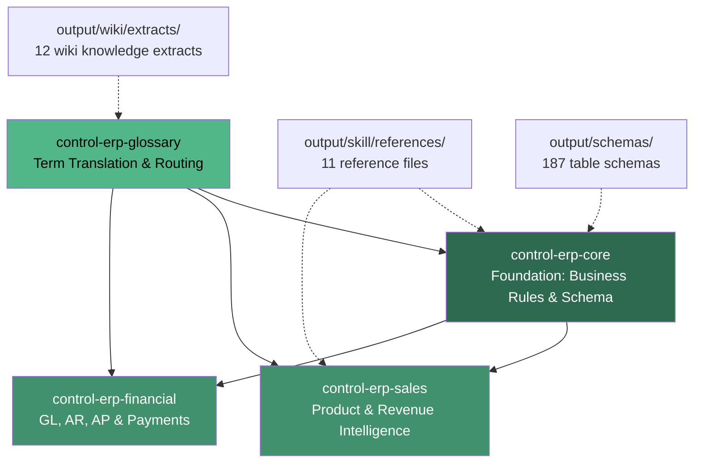

# FLS Banners ERP Skill Architecture

This document describes the skill package structure for querying the FLS Banners Control ERP database. It answers: "What skills exist, how do they relate, and how does the order lifecycle work?"

For query patterns organized by business question, see `output/docs/query-pattern-reference.md`.

---

## Skill Dependency Graph

**Arrows:** Solid = runtime dependency (must load first). Dashed = supporting reference (load on demand).

---

## Skill Summaries

### 1. control-erp-core (Foundation)

| Attribute | Value |
|-----------|-------|
| **File** | `skills/control-erp-core/control-erp-core-SKILL.md` |
| **Lines** | 347 |
| **Dependencies** | None (load first, always) |
| **Purpose** | Validated business rules, TransactionType/StatusID mappings, standard query filters, pricing field selection, and schema relationships for the Control ERP StoreData database. |

**Domains covered:**
- TransactionType definitions and validation
- StatusID lifecycle for all transaction types
- Revenue query formula (validated to 99.98%)
- Date filtering patterns (SaleDate, EstimateCreatedDate)
- Pricing field reference (SubTotalPrice vs TotalPrice)
- Standard query filters and TransDetailParam rules
- Core JOIN patterns (Header-Detail-Param-Account-Employee)
- GL/Ledger architecture overview
- High-volume table performance notes

**Key sections:** CRITICAL: Revenue Query Formula, TransactionType Reference, Standard Query Filters, Date Filtering Patterns, StatusID Reference

### 2. control-erp-sales (Product & Revenue Intelligence)

| Attribute | Value |
|-----------|-------|
| **File** | `skills/control-erp-sales/control-erp-sales-SKILL.md` |
| **Lines** | 370 |
| **Dependencies** | control-erp-core |
| **Purpose** | Query FLS Banners sales and revenue data including product-level reporting via DyeSub Print container variables, table cover identification, customer analysis, and sales trends. |

**Domains covered:**
- DyeSub Print container product architecture (20+ categories)
- DyeLux table cover identification (Description-based)
- Non-container product groups (apparel, design, tents, shipping)
- Customer revenue analysis
- Salesperson performance
- Year-over-year comparison
- Full revenue reconciliation

**Key sections:** Product Architecture at FLS Banners, Query Templates (9 templates), Natural Language Interpretation, Important Caveats

### 3. control-erp-financial (GL, AR, AP & Payments)

| Attribute | Value |
|-----------|-------|
| **File** | `skills/control-erp-financial/control-erp-financial-SKILL.md` |
| **Lines** | 856 |
| **Dependencies** | control-erp-core |
| **Purpose** | Query GL/Ledger transactions, accounts receivable, accounts payable, P&L, payment tracking, deposit workflow, and balance sheet data from Control ERP. |

**Domains covered:**
- GL/Ledger architecture (GL view vs Ledger table, off-balance sheet)
- Chart of accounts (GLAccount hierarchy, NodeIDs)
- Revenue and COGS account mappings
- GL transaction flows (order lifecycle, bill lifecycle)
- Payment posting patterns (prepaid vs credit paths)
- Deposit workflow (undeposited funds to bank)
- Accounts receivable (snapshot, aging, payment terms)
- Accounts payable (snapshot, aging)
- P&L reporting (revenue by product line, full P&L, summary)
- Balance sheet key accounts
- Closeout / period locking

**Key sections:** GL Transaction Flows, Payment Posting Patterns, Accounts Receivable, Accounts Payable, P&L from GL, Natural Language Interpretation

### 4. control-erp-glossary (Term Translation & Routing)

| Attribute | Value |
|-----------|-------|
| **File** | `skills/control-erp-glossary/control-erp-glossary-SKILL.md` |
| **Lines** | 491 |
| **Dependencies** | Routes to core, sales, and financial skills |
| **Purpose** | Maps FLS Banners business language and Control ERP technical terminology to database entities and the correct skill to consult. |

**Domains covered:**
- FLS product line terminology (20 DyeSub Print categories, 7 non-DyeSub groups)
- Control technical terminology (CHAPI, SSLIP, CFL, SQLBridge, ClassTypeID)
- Database field and pattern definitions (SeqID, TransactionType, StatusID, SubTotalPrice)
- Order lifecycle and workflow terminology
- Pricing and product concepts (PricingPlan, Variable, Modifier)
- Financial concepts (GL View, Ledger, Journal, Payment, Closeout)

**Key sections:** FLS Product Line Terminology, Control Technical Terminology, Order Lifecycle and Workflow Terminology, Natural Language Routing Table

---

## How Skills Interact

When a user asks a business question, skills are consulted in a specific order depending on the question type.

**Step 1: Term resolution.** If the question uses FLS business language ("blanket orders," "SEG revenue," "step and repeat") or Control-specific terms ("ClassTypeID," "CHAPI"), the glossary skill translates the term to its database identification pattern and routes to the appropriate skill. For example, "blanket orders" maps to `Description LIKE '%Blanket%'` and routes to control-erp-sales Template 8.

**Step 2: Business rules.** The core skill is always consulted for foundational rules regardless of question type. It provides the TransactionType filter (Type 1 for revenue, Type 2 for estimates), the correct pricing field (SubTotalPrice, not TotalPrice), the correct date field (SaleDate for revenue, EstimateCreatedDate for estimates), and the standard query filters (IsActive = 1, StatusID != 9, SaleDate IS NOT NULL for revenue). These rules prevent known errors worth $1.3M+ in potential miscounts.

**Step 3: Domain-specific templates.** The sales skill provides 9 query templates for product breakdown, customer analysis, and trend reporting. The financial skill provides templates for AR, AP, P&L, GL register queries, and payment analysis. Each template builds on core business rules and is validated against FLS's actual 2025 financial data.

**Step 4: Supporting references.** When a query requires lookup values (ClassTypeID mappings, field value enumerations, join patterns), the 11 reference files in `output/skill/references/` and the 12 wiki extracts provide supplementary data. These are loaded on demand, not preloaded.

---

## Supporting Reference Files

### Skill Reference Files (output/skill/references/)

| File | Lines | Provides | Used By |
|------|-------|----------|---------|
| `schema_reference.md` | 1,084 | Complete table/column reference by domain | core, sales, financial |
| `nl_query_patterns.md` | 962 | Pre-validation NL query patterns (superseded by skill NL sections) | historical reference |
| `query_patterns.md` | 892 | Real-world query patterns from Crystal Reports | core, sales |
| `advanced_analytics.md` | 583 | BI queries (CLV, RFM, churn, forecasting) | future milestone |
| `classtypeid_reference.md` | 570 | 350+ ClassTypeID mappings | core, glossary |
| `common_joins.md` | 541 | Every join pattern with examples | core, sales, financial |
| `stored_procedures.md` | 384 | SQL Bridge stored procedure templates | integration reference |
| `field_values.md` | 367 | Field value enumerations (StatusID, etc.) | core, glossary |
| `relationships.md` | 326 | All FK and inferred table relationships | core |
| `quick_reference.md` | 214 | Cheat sheet for common queries | all skills |
| `business_rules_validation.md` | 156 | Validated business rule documentation | core |

### Wiki Knowledge Extracts (output/wiki/extracts/)

| File | Lines | Provides |
|------|-------|----------|
| `cfl_formula_language_knowledge.md` | 1,650 | CFL expression language reference |
| `sql_queries_reference.md` | 1,480 | 40+ utility/diagnostic SQL queries from wiki |
| `products_pricing_knowledge.md` | 1,268 | Product and pricing architecture |
| `parts_knowledge.md` | 1,259 | Parts, inventory, and BOM knowledge |
| `macros_automation_knowledge.md` | 1,172 | Macro triggers, actions, and automation |
| `udfs_custom_fields_knowledge.md` | 1,172 | User-defined fields and custom field setup |
| `database_integration_knowledge.md` | 1,155 | SQL Bridge, CHAPI, ClassTypeIDs |
| `howto_troubleshooting_knowledge.md` | 980 | Procedures and troubleshooting |
| `crm_payroll_system_knowledge.md` | 838 | CRM, payroll, timecards, security |
| `email_notifications_knowledge.md` | 827 | Email templates and notification rules |
| `orders_accounting_knowledge.md` | 816 | Order lifecycle, GL, payments, tax |
| `production_inventory_knowledge.md` | 796 | Artwork, production, parts, shipping |

### Schema Files

`output/schemas/` contains 187 individual table schema files documenting every table in the StoreData database (columns, data types, nullable, FK relationships, row counts, sample data).

---

## Order Lifecycle (DOC-03)

This table maps each order stage to its StatusID, key database tables, GL entries created, and the skill section containing query guidance.

### Type 1 Order: Estimate through Closed

| Stage | StatusID | Key Tables | GL Entries | Skill Reference |
|-------|----------|------------|------------|-----------------|
| **Estimate** | Type 2, StatusID 11 (Pending) | TransHeader, TransDetail | None | core: TransactionType Reference |
| **Estimate Converted** | Type 2, StatusID 13 | TransHeader (creates linked Type 1) | None | core: Estimate to Order Linkage |
| **New Order** | Type 1, StatusID 0 (New) | TransHeader, TransDetail, TransPart | WIP (11) up, Orders Due (21) up | financial: GL Transaction Flows, Stage 1 |
| **Deposit Received** | (no StatusID change) | Payment, Journal, Ledger | Undeposited (92/93) up, Order Prepayments (24) up | financial: GL Transaction Flows, Stage 2 |
| **WIP** | Type 1, StatusID 1 | TransHeader, TransDetail, ArtworkItem, Station | None (GL unchanged from New) | core: StatusID Reference |
| **Built** | Type 1, StatusID 2 | TransHeader | WIP (11) to Built (12); Inventory (10414) to FGI (34) | financial: Built Status, Stage 2.5 |
| **Sale** | Type 1, StatusID 3 (SaleDate set) | TransHeader, Ledger, GLAccount | Revenue up, COGS up; AR (14) or Prepayments (24) cleared | financial: GL Transaction Flows, Stage 3a/3b |
| **Closed** | Type 1, StatusID 4 (BalanceDue = 0) | TransHeader, Payment | AR (14) cleared via payment | financial: Payment Posting Patterns |
| **Voided** | Type 1, StatusID 9 | TransHeader | All GL entries reversed | core: StatusID Reference |

### Shipping (parallel to WIP/Built/Sale)

| Stage | Key Tables | GL Entries | Skill Reference |
|-------|------------|------------|-----------------|
| Shipment created | Shipments, ShippingMethod | None | output/schemas/Shipments.md |
| FedEx tracking | FedExShippingLog, FedExShippingLogForShipments | None | output/schemas/FedExShippingLog.md |
| UPS tracking | UPSShippingLog, UPSShippingLogForShipments | None | output/schemas/UPSShippingLog.md |

### Vendor Purchasing Chain (Types 7, 8, 9)

| Stage | Type / StatusID | Key Tables | GL Entries | Skill Reference |
|-------|----------------|------------|------------|-----------------|
| PO Created | Type 7, StatusID 25 (Requested) | TransHeader, TransDetail | None | core: TransactionType Reference |
| PO Approved | Type 7, StatusID 26 | TransHeader | None | core: StatusID Reference |
| PO Ordered | Type 7, StatusID 27 | TransHeader | None | core: StatusID Reference |
| Bill Created | Type 8, StatusID 6 (Open) | TransHeader, TransDetail | COGS/Expense up, AP (22) up | financial: Bill Lifecycle |
| Bill Paid | Type 8, StatusID 4 (Closed) | TransHeader, Payment | AP (22) down, Cash-Checking (90) down | financial: Bill Lifecycle |
| Goods Received | Type 9, StatusID 4 | TransHeader | Inventory adjustments | core: TransactionType Reference |

### Payment and Deposit Workflow

| Stage | Key Tables | GL Entries | Skill Reference |
|-------|------------|------------|-----------------|
| Payment received | Payment, Journal | Undeposited account up; AR (14) or Prepayments (24) cleared | financial: Payment Posting Patterns |
| Deposit processed | Ledger (DepositJournalID) | Cash-Checking (90) up; Undeposited account down | financial: Deposit Workflow |
| ACH/Wire received | Payment | Cash-Checking (90) up directly (bypasses undeposited) | financial: TenderType Reference |

---

*Generated from skill files validated against FLS Banners 2025 financial data. Revenue accuracy: 99.98%. Scorecard: 21/21 PASS.*
